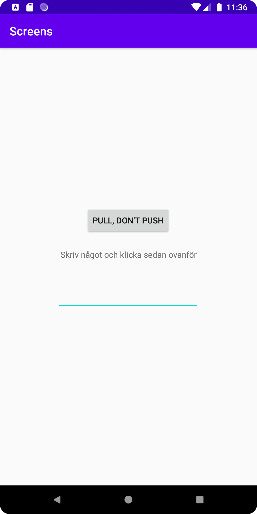
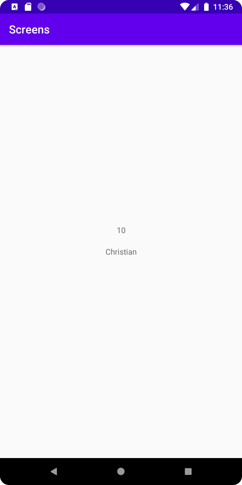

# Rapport

1. Skapade en ny empty activity
2. Lade till knapp i main activity som länkades till den nya activityn. XML för knapp samt kod för själva länkningen nedan.
```
Button
        android:id="@+id/buttonHome"
        android:layout_width="wrap_content"
        android:layout_height="wrap_content"
        android:text="Pull, don't push"
        app:layout_constraintBottom_toBottomOf="parent"
        app:layout_constraintEnd_toEndOf="parent"
        app:layout_constraintHorizontal_bias="0.498"
        app:layout_constraintStart_toStartOf="parent"
        app:layout_constraintTop_toTopOf="parent"
        app:layout_constraintVertical_bias="0.387" />
```
```
 button1=findViewById(R.id.buttonHome);

        button1.setOnClickListener(new View.OnClickListener() {
            @Override
            public void onClick(View view) {
                Intent intentNewActivity = new Intent(MainActivity.this,Activity2.class);
                startActivity(intentNewActivity);
```

3. Skapade en EditText i main. För att kunna skicka input-data. XML samt kod för input nedan.

```
    <EditText
        android:id="@+id/EditTextMain"
        android:layout_width="240dp"
        android:layout_height="50dp"
        app:layout_constraintBottom_toBottomOf="parent"
        app:layout_constraintEnd_toEndOf="parent"
        app:layout_constraintHorizontal_bias="0.497"
        app:layout_constraintStart_toStartOf="parent"
        app:layout_constraintTop_toBottomOf="@+id/textView2"
        app:layout_constraintVertical_bias="0.104" />
```
```
button1.setOnClickListener(new View.OnClickListener() {
            @Override
            public void onClick(View view) {
                EditText EditTextMain = findViewById(R.id.EditTextMain);
                String passText = EditTextMain.getText().toString();
                Intent intentNewActivity = new Intent(MainActivity.this,Activity2.class);
                startActivity(intentNewActivity);
```
(Initierar EditTextMain. Raden under tar texten ifrån elementet och skapar en string)

4. Lägger även in raderna nedan för att skicka det statiska värdet 10, samt input från Edittext.

```
              intentNewActivity.putExtra("number", 10);
              intentNewActivity.putExtra("text", passText);
```

5. Lägger sedan in två enkla textviews i activity_2.xml. Den ena ska visa strängen, den andra int.
   De får ID "secondTextString" och "secondTextNumber"

6. Lägger in bundle extras i den nya activityn (activity2).
   Värdena hämtas och därefter används ID  för att köra setText med de nya värdena.
   Fick konvertera int till string eftersom appen kraschade.

```
 Bundle extras = getIntent().getExtras();
        if (extras != null) {
            String text = extras.getString("text");
            int number = extras.getInt("number");

            //Set text for first textView
            TextView textString = findViewById(R.id.secondTextString);
            textString.setText(text);

            //Set int for second textView (number had to be converted)
            String test = String.valueOf(number);
            TextView passInt = findViewById(R.id.secondTextNumber);
            passInt.setText(test);
```


Main activity


Second activity
